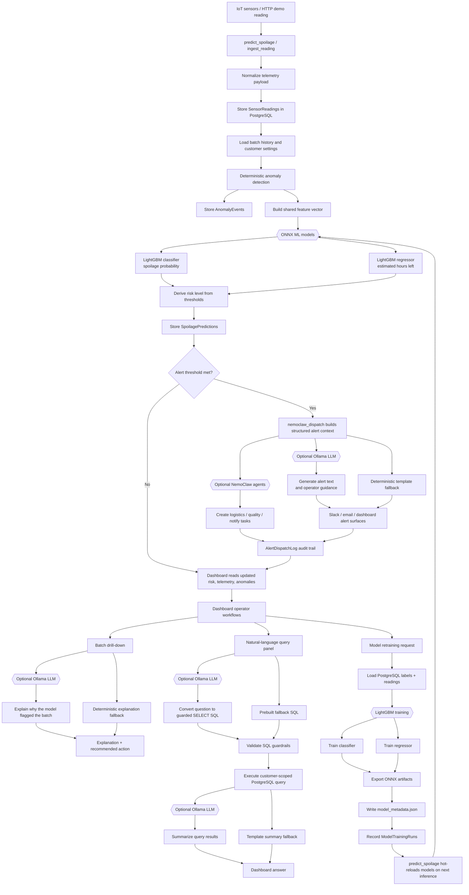

# PerishGuard AI Model Flow

This diagram shows where AI and ML models are used in the overall PerishGuard flow.

## Quick Reading

- **ONNX LightGBM models** are the authoritative scoring layer. They produce spoilage probability and estimated shelf-life hours.
- **Deterministic rules** handle anomaly detection, thresholds, SQL validation, and fallback text.
- **Ollama** is used only for explanation, alert copy, query generation, and summarization.
- **NemoClaw** is used only for optional operational task dispatch after risk has already been calculated.
- **Retraining** updates the LightGBM models and exports fresh ONNX artifacts for the live inference path.

## Responsibility Boundary

| Area | Uses AI/ML? | Responsibility |
|---|---:|---|
| Spoilage prediction | Yes, ONNX LightGBM | Calculate probability and hours left |
| Anomaly detection | No | Apply deterministic sensor rules |
| Alert copy | Optional Ollama | Explain the already-computed risk |
| Batch explanation | Optional Ollama | Explain drivers and recommended action |
| Natural-language queries | Optional Ollama | Convert questions to guarded SQL and summarize rows |
| NemoClaw dispatch | Optional agent system | Create operational tasks from prediction context |
| Retraining | Yes, LightGBM | Train and export new classifier/regressor models |
